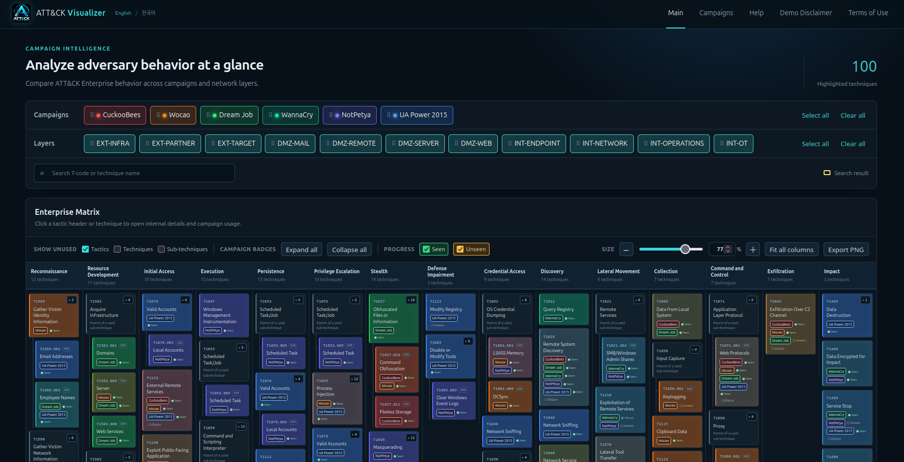

# ATT&CK Visualizer

**English** | [한국어](README.ko.md)

ATT&CK Visualizer is a local-first web application for comparing campaign-level
adversary behavior across the **MITRE ATT&CK Enterprise Matrix**. Campaign JSON
files are the source of truth, and no database is required.

<p align="center"></p>
<p align="center"><em>Campaign and layer selections mapped onto the ATT&amp;CK Enterprise Matrix.</em></p>

- Python 3.11+ / FastAPI / Jinja2 / Vanilla JavaScript
- MITRE ATT&CK Enterprise v19.2
- Docker or local Python operation
- Default URL: <http://127.0.0.1:8000> (configured by `ATTVIZ_PORT` in `.env`)

## Key Features

- Automatic discovery and web-based creation, editing, renaming, duplication,
  and deletion of `data/campaigns/*.json`
- Multi-select campaigns and layers with grouped `EXT`/`DMZ`/`INT` defaults and draggable display ordering
- ATT&CK tactic, technique, and sub-technique hierarchy with unused-item filters
- Campaign color blending, nickname badges, and expandable overlap details
- Per-T-code seen/unseen progress tracking, dashboard status filters, and analyst comments
- T-code and technique-name search, hover summaries, and internal detail pages
- Automatic initial fit-to-width, manual matrix zoom, and PNG export reflecting the current view
- Graceful isolation and reporting of malformed JSON, schemas, and T-codes
- English and Korean functional UI and help content

Open `/help` after starting the application for complete feature and campaign
JSON documentation.

## Run with Docker

Docker Engine or Docker Desktop with Docker Compose v2 is required.

Ubuntu, macOS, WSL2, or Git Bash:

```bash
./scripts/docker.sh rebuild
```

Windows PowerShell:

```powershell
.\scripts\docker.ps1 rebuild
```

Open <http://127.0.0.1:8000>. Run the same `rebuild` command again after
changing application source or dependencies.

To change the port, edit the single setting in the root `.env` and rebuild:

```dotenv
ATTVIZ_PORT=8080
```

The URL then becomes <http://127.0.0.1:8080>. Compose port mapping, container
Uvicorn, health checks, and management scripts all use this value.

Common management commands:

```bash
./scripts/docker.sh up
./scripts/docker.sh stop
./scripts/docker.sh restart
./scripts/docker.sh down
./scripts/docker.sh logs
./scripts/docker.sh status
./scripts/docker.sh health
```

Use the same subcommands with `docker.ps1` in PowerShell.

Compose bind-mounts `data/campaigns/` into the container, so campaign JSON files
remain on the host when the container is recreated. The service is published
only on `127.0.0.1` by default.

## Run with Local Python

```bash
python -m venv .venv
source .venv/bin/activate
python -m pip install -r requirements.txt
python -m app.server --reload
```

Windows PowerShell:

```powershell
py -3.12 -m venv .venv
.venv\Scripts\Activate.ps1
python -m pip install -r requirements.txt
python -m app.server --reload
```

## Data Locations

```text
data/campaigns/                     User campaign JSON files
data/attack/enterprise-attack.json  MITRE ATT&CK Enterprise STIX bundle
```

Campaign files can be copied or edited manually or managed through
`/campaigns`. Filesystem JSON remains the sole source of truth.

Minimal example:

```json
{
  "schema_version": "1.0",
  "name": "Example Campaign",
  "nickname": "Example",
  "description": "Example multi-layer campaign",
  "color": "#3b82f6",
  "attribution_candidates": ["Example attribution candidate"],
  "layers": [
    {
      "name": "External",
      "description": "Internet-facing activity",
      "techniques": [
        {"id": "T1595.002", "status": "seen"},
        {"id": "T1190", "status": "unseen", "comment": "Awaiting firewall corroboration."}
      ]
    },
    {
      "name": "Internal Network",
      "techniques": [
        {"id": "T1018", "status": "seen"},
        {"id": "T1059.001", "status": "seen", "comment": "Observed in endpoint telemetry."}
      ]
    }
  ]
}
```

Store ATT&CK T-codes rather than technique names. A T-code may appear in
multiple layers, and only explicitly listed codes are highlighted. Listing a
sub-technique does not automatically highlight its parent. Each entry has one
mutually exclusive `seen` or `unseen` status and may include a `comment`.
Legacy string entries remain readable as `seen` and are normalized when saved
through the web editor.

On the matrix, every borderless status control opens the same layer-aware editor,
whether the T-code occurs in one selected layer or several. The editor shows
layer-specific status and comments, supports individual updates, and requires
confirmation for explicit bulk actions. Differing states use a `Mixed` aggregate
indicator. No separate note marker is displayed in the matrix cell.

A layer is a user-defined analytical unit, not an ATT&CK tactic or a prescribed
network tier. Choose the abstraction level that fits the analysis—for example,
network zones, individual assets, environments, security domains, or logical
campaign stages—and use one consistent criterion within a campaign. Array order
expresses the analyst's intended progression, and the same T-code may occur in
multiple layers.

## Main Routes

| Route | Description |
| --- | --- |
| `/` | ATT&CK Matrix visualization |
| `/campaigns` | Campaign file management |
| `/help` | Detailed usage and FAQ |
| `/disclaimer` | Demo data and attribution guidance |
| `/terms` | License and third-party notices |
| `/docs` | FastAPI OpenAPI documentation |

## Demo Data Disclaimer

The `demo-*.json` files are synthetic examples informed by public material
from sources such as MITRE ATT&CK and CISA, then condensed, combined, or
enriched for feature demonstration. They are not complete or authoritative
incident reconstructions and do not represent independent attribution findings
by this project. See `/disclaimer` for the full explanation.

The demos consistently use `EXT-*`, `DMZ-*`, and `INT-*` layer names to identify
the trust zone first and one asset or operational tag second. This is a demo
convention rather than an application validation rule.
WannaCry deliberately assigns `T1210` different states in `INT-ENDPOINT` and
`INT-NETWORK` to demonstrate the matrix's multi-layer `Mixed` state. Comments
appear on both seen and unseen entries and provide analyst context rather than
determining status.

## License and Operating Scope

Project code and original assets are available under the
[PolyForm Noncommercial License 1.0.0](LICENSE). Commercial use, including
internal use by a for-profit organization, requires separate written
permission. See [LICENSE](LICENSE) and [NOTICE.md](NOTICE.md) for the controlling
terms and third-party notices.

The bundled MITRE ATT&CK STIX data remains subject to the separate
[MITRE ATT&CK data license](data/attack/LICENSE.txt).

This application is an unauthenticated local analysis tool. Public-network or
multi-user deployment requires separate authentication, TLS, access controls,
and appropriate operational security.
